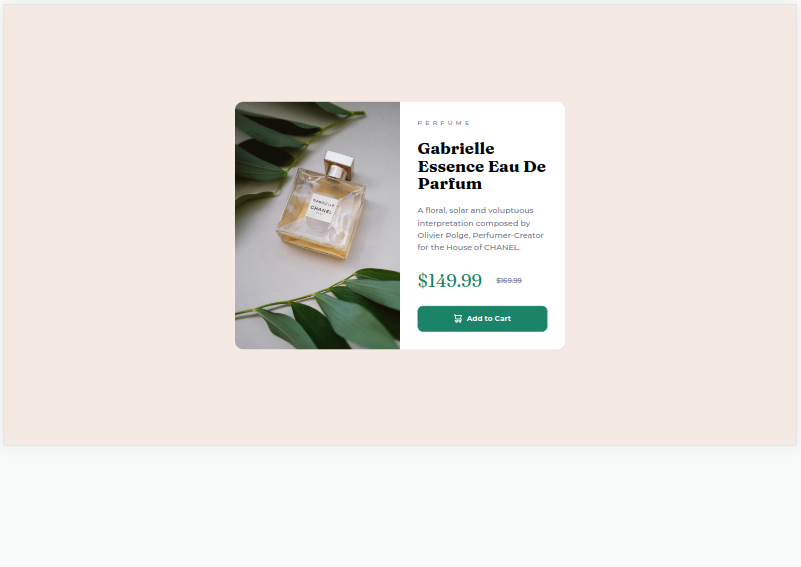

# Frontend Mentor - Product preview card component solution

This is a solution to the [Product preview card component challenge on Frontend Mentor](https://www.frontendmentor.io/challenges/product-preview-card-component-GO7UmttRfa). Frontend Mentor challenges help you improve your coding skills by building realistic projects. 

## Table of contents

- [Overview](#overview)
  - [The challenge](#the-challenge)
  - [Screenshot](#screenshot)
  - [Links](#links)
- [My process](#my-process)
  - [Built with](#built-with)
  - [What I learned](#what-i-learned)
  - [Continued development](#continued-development)
  - [Useful resources](#useful-resources)
- [Author](#author)
- [Acknowledgments](#acknowledgments)

**Note: Delete this note and update the table of contents based on what sections you keep.**

## Overview

### The challenge

Users should be able to:

- View the optimal layout depending on their device's screen size
- See hover and focus states for interactive elements

### Screenshot




**Note: Delete this note and the paragraphs above when you add your screenshot. If you prefer not to add a screenshot, feel free to remove this entire section.**

### Links

- Solution URL: [github](https://github.com/ernest-ayitey/Product-preview-card-component-)
- Live Site URL: [Add live site URL here](https://your-live-site-url.com)

## My process

### Built with

- Semantic HTML5 markup
- CSS custom properties
- Flexbox
- CSS Grid
- Mobile-first workflow


### What I learned

Use this section to recap over some of your major learnings while working through this project. Writing these out and providing code samples of areas you want to highlight is a great way to reinforce your own knowledge.

To see how you can add code snippets, see below:

```html
<h1>Some HTML code I'm proud of</h1>
```
```css
.container {
    background-color: var(--white);
    display: grid;
    grid-template-columns: repeat(2, 1fr);
    max-width: 90%;
    width: 37.5rem;
    margin: 0 auto;
    margin-top: 11rem;
    margin-bottom: 10%;
    border-radius: 15px;
}

.img-item {
    background-image: url("./images/image-product-desktop.jpg");
    background-position: center;
    background-size: cover;
    width: 100%;
    border-radius: 15px 0 0 15px;
    background-repeat: no-repeat;
}
```

### Continued development

Animation 
layouts
using right tags


## Author

- Frontend Mentor - [@Ernestayitey](https://www.frontendmentor.io/profile/yourusername)

## License

This project is [MIT](https://github.com/ernest-ayitey/product-preview-card-component/blob/main/LICENSE) licensed


